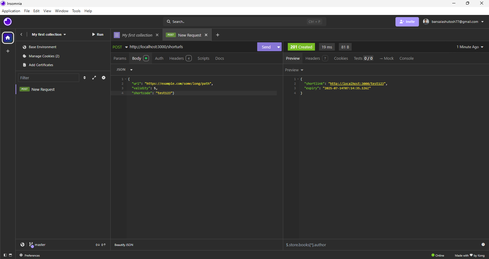
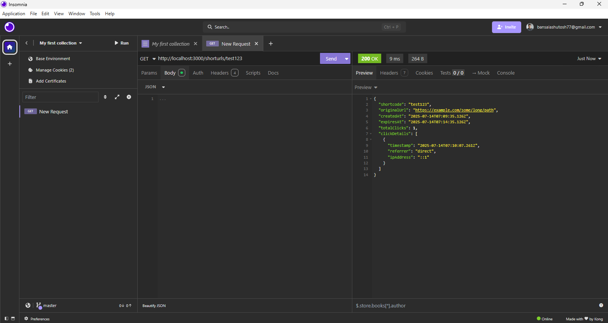

# URL-shortner

## A URL-Shortner

- **Name:** Ashutosh Bansal  
- **Roll No:** 2200640100034
- **Course:** B.Tech in Computer Science  
- **College:** Hindustan College of science and technology  

## Description


### Retrieving URL Statistics (Insomnia)






# HTTP URL Shortener Microservice

This project is a backend microservice built with **Node.js** and **Express.js** that provides URL shortening functionality. It allows users to create, manage, and track shortened URLs.

## Features

* **URL Shortening:** Convert long URLs into concise, short links.
* **Custom Shortcodes:** Optionally specify a desired shortcode for your links. If omitted, a unique one will be generated.
* **Link Validity:** Set an optional expiration time (in minutes) for short links. Defaults to 30 minutes.
* **Redirection:** Redirect users from the short URL to the original long URL.
* **Click Analytics:** Track and retrieve basic usage statistics for each short link, including total clicks, referrer, and approximate IP location of clicks.
* **Mandatory Logging Integration:** Extensively uses a custom logging middleware that integrates with an external evaluation logging API.
* **In-memory Data Storage:** For demonstration and easy setup, the project uses in-memory data storage, meaning no external database (like MongoDB) is required to run the application. Data will reset upon server restart.

## Technology Stack

* **Backend:** Node.js
* **Web Framework:** Express.js
* **Shortcode Generation:** `nanoid`
* **Environment Variables:** `dotenv`
* **HTTP Client:** `axios` (for external API calls)

<!-- ## Features

- Feature 1
- Feature 2
- Feature 3

## How to Run

1. Clone the repository:
   ```bash
   git clone https://github.com/your-username/your-repo-name.git -->
